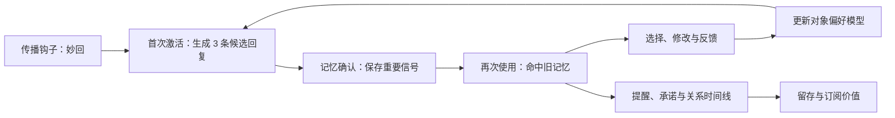
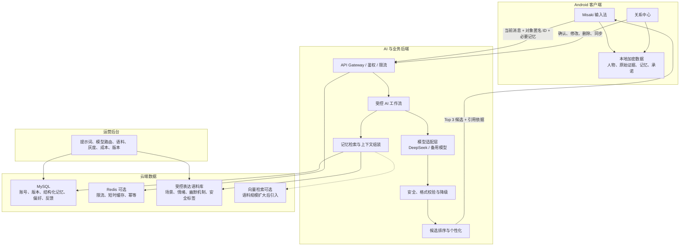
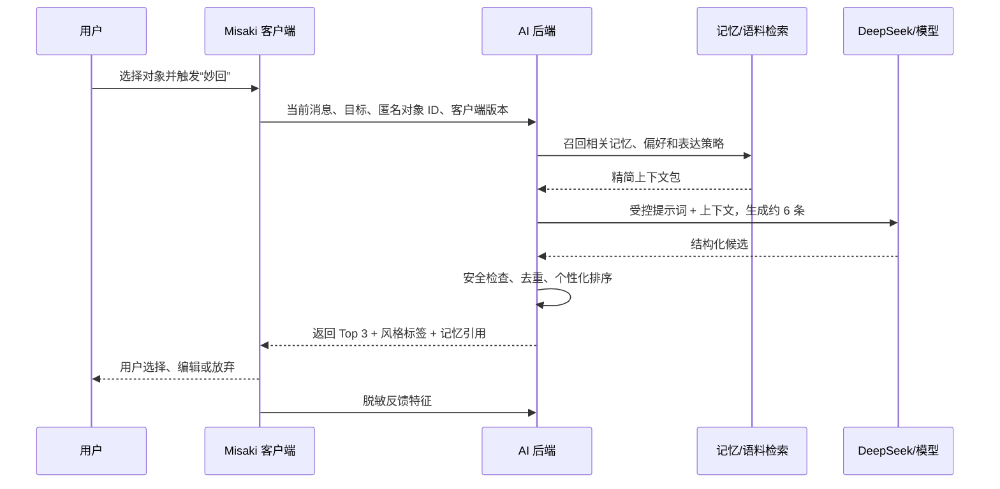
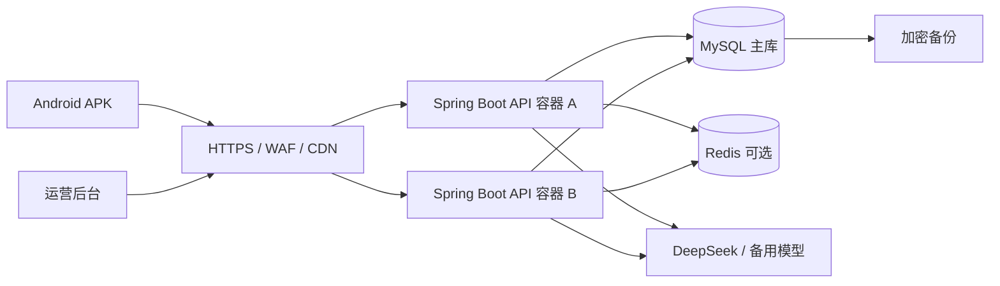

# Misaki 关系记忆与 AI 沟通助手：业务与技术架构

> 文档状态：架构基线（Draft）
> 适用范围：Misaki Android 输入法、Misaki 主应用、AI 后端与运营后台
> 核心定位：**记住重要的人，说过的重要事。**

## 1. 文档目的

本文把 Misaki 从“输入法工具”扩展为“关系记忆与沟通助手”的业务模式、产品边界和技术选型统一下来，作为后续产品设计、接口设计和分阶段开发的依据。

本文重点回答以下问题：

- 哪些能力应当放在 APK，哪些能力应当放在后端；
- 是否需要保存用户的全部聊天记录；
- 首版是否应该建设聊天 RAG；
- DeepSeek 等大模型、幽默语料和个性化偏好怎样协同；
- 为什么本方案默认选择 MySQL，而不是把 PostgreSQL 设为硬依赖；
- 模型、提示词、语料和排序策略怎样做到不发版即可升级；
- 如何兼顾关系记忆、个性化效果、隐私和商业化。

## 2. 产品定义

### 2.1 产品不是“替用户聊天”

Misaki 不应被定义为自动代聊或“恋爱话术生成器”。核心能力是：

1. 用户主动选择一个沟通对象；
2. Misaki 帮用户记住经用户确认的重要事实、偏好、承诺和时间点；
3. 在用户需要回复时，结合当前消息、关系记忆和表达策略生成候选回复；
4. 用户始终负责选择、修改和发送；
5. 系统从用户选择、修改和明确反馈中逐渐学习更合适的表达方式。

因此，Misaki 的产品资产不是“保存了多少聊天”，而是：

- 可信、可修正的关系记忆；
- 对不同沟通对象的表达偏好理解；
- 可持续迭代的情绪沟通和幽默表达能力；
- 用户对隐私和控制权的信任。

### 2.2 核心业务闭环



业务增长路径为：

> 妙回带来传播和激活 → 关系记忆带来留存 → 个性化回复、提醒和总结形成付费价值。

### 2.3 三个产品界面

| 入口 | 主要职责 | 使用频率 |
| --- | --- | --- |
| 输入法 | 选择当前对象、读取用户主动提供的消息、生成妙回、插入文本、快速记一下 | 高频、即时 |
| Misaki 主应用 | 人物管理、记忆确认与修改、时间线、承诺、提醒、隐私设置 | 中低频、管理型 |
| 系统通知 | 重要日期、未完成承诺、需要跟进的关系事项 | 低频、主动触达 |

## 3. 产品原则与边界

### 3.1 首版必须坚持的原则

- **用户主动触发**：不在后台偷读剪贴板，不自动监听其他 App。
- **不自动发送**：AI 只提供候选，最终发送由用户完成。
- **最小数据原则**：只处理完成本次功能所必需的上下文。
- **事实与推测分离**：事实、用户笔记、模型推测使用不同类型保存。
- **记忆必须可见、可改、可删**：模型不得偷偷积累不可解释的“人格档案”。
- **敏感信息默认本地**：服务端只保存用户同意同步的结构化记忆。
- **核心功能不做成 Lua 插件**：关系记忆是产品主能力，应由主应用稳定承载。

### 3.2 首版明确不做

- 自动读取全部微信或其他聊天记录；
- 后台持续读取剪贴板；
- 使用无障碍服务自动抓取对话或自动发送；
- 自动识别真实联系人身份；
- 对沟通对象进行心理诊断、人格定性；
- 为每一个对象训练一个独立大模型；
- 全量聊天云同步、情侣共同空间、多模态长期档案；
- 在在线回复链路中使用开放式、不可控的多 Agent 自主执行。

## 4. 总体架构结论

Misaki 采用“**端侧可信记忆 + 云端可升级智能 + 稳定版本化接口**”的混合架构。



这套架构的直接结果是：

- 更换模型、调整提示词、扩充幽默语料、优化检索和排序，通常不需要 APK 发版；
- 新增权限、改变交互、修改本地数据结构、引入端侧模型或破坏接口兼容时，仍需要 APK 发版；
- 默认不把完整聊天记录上传云端，也不把全部对话塞入模型上下文；
- 客户端即使暂时离线，仍能查看和管理本地关系记忆。

## 5. 客户端与后端职责

### 5.1 APK 负责稳定的产品能力

客户端负责：

- 当前沟通对象的选择与切换；
- 用户主动复制、粘贴或选择消息后的“妙回”操作；
- 展示、编辑和插入候选回复；
- “记一下”入口、记忆候选确认、冲突处理和删除；
- 人物页、关系时间线、承诺和提醒；
- 本地敏感原文与来源证据的保存；
- 用户授权、隐私控制、数据导出和清空；
- 将选择、编辑比例和明确反馈转换为结构化反馈信号。

### 5.2 后端负责可持续升级的智能

后端负责：

- DeepSeek 等模型供应商的调用、路由、超时、重试与降级；
- 提示词模板和输出协议的版本管理；
- 已确认结构化记忆的检索和上下文组装；
- 情绪表达与幽默语料的召回；
- 多候选生成、去重、安全检查和个性化排序；
- 用量、订阅权益、灰度发布和 A/B 实验；
- 模型质量、延迟、错误率和成本监控。

### 5.3 不发版升级边界

| 变更 | 是否通常需要 APK 发版 |
| --- | --- |
| DeepSeek 切换到其他兼容模型 | 否 |
| 修改提示词、温度、生成候选数 | 否 |
| 新增或调整幽默语料 | 否 |
| 改进记忆召回和候选排序 | 否 |
| 服务端安全策略、限额、灰度 | 否 |
| 在已有字段中返回新的可选元数据 | 否 |
| 新增客户端页面或交互入口 | 是 |
| 新增系统权限或后台能力 | 是 |
| 修改本地数据库结构 | 是 |
| 删除客户端依赖的接口字段 | 是，且必须先做兼容迁移 |

## 6. 数据与记忆架构

### 6.1 不保存全部聊天，而是保存“特殊信号”

妙回链路不以全量聊天 RAG 为前提。每次请求建议只包含：

- 当前对方消息；
- 用户可选提供的最近 1～3 轮上下文；
- 当前沟通目标，例如“安慰”“拒绝”“轻松化解”；
- 与当前语义相关的少量已确认记忆；
- 当前对象的表达偏好向量；
- 必要的安全和语言设置。

适合沉淀为记忆点的信号包括：

- 生日、纪念日和重要日期；
- 明确偏好与禁忌；
- 已做出的承诺和待办；
- 最近重大事件和情绪背景；
- 特定称呼、表达习惯和边界；
- 用户明确要求记住的内容；
- 经多次反馈验证的沟通偏好。

### 6.2 事实、推测与偏好分层

| 类型 | 示例 | 保存规则 |
| --- | --- | --- |
| 事实 Fact | “她 9 月 18 日生日” | 需用户确认，可长期保存 |
| 用户笔记 Note | “下次见面问工作进展” | 用户主动创建，可编辑 |
| 承诺 Commitment | “周末把照片发给他” | 可转为提醒和完成状态 |
| 推测 Inference | “最近可能不想聊工作” | 标注置信度和失效时间，不冒充事实 |
| 互动偏好 Preference | “更喜欢简短、温暖、少说教” | 来源可解释，可随反馈衰减或重置 |
| 原始证据 Source | 被截取的消息片段 | 默认仅本地保存，不作为云端永久档案 |

### 6.3 本地核心实体

建议在现有 Android 工程中逐步引入以下实体：

- `Person`：用户创建的沟通对象，不要求绑定系统联系人；
- `SourceArtifact`：记忆来源片段，仅本地保存；
- `MemoryCandidate`：模型提取但尚未确认的候选；
- `MemoryItem`：已确认事实、笔记或推测；
- `Commitment`：承诺、负责人、截止时间和完成状态；
- `TimelineEvent`：关系时间线事件；
- `Reminder`：提醒计划与触发状态；
- `RecipientPreferenceProfile`：面向该对象的表达偏好；
- `GenerationRecord`：一次生成的候选摘要和版本信息；
- `InteractionFeedback`：选择、编辑、取消及显式反馈。

### 6.4 云端保存范围

默认混合模式下，云端可以保存：

- 匿名账号、设备、订阅权益和用量；
- 提示词版本、模型路由、功能开关；
- 用户同意同步的结构化记忆；
- 不含真实姓名的对象匿名 ID；
- 对象表达偏好向量和反馈特征；
- 幽默与情绪表达语料；
- 请求质量指标和脱敏错误信息。

云端默认不保存：

- 完整聊天记录；
- 系统通讯录和真实联系人映射；
- 未经确认的长期人格判断；
- 可直接还原私人对话的日志；
- 与服务功能无关的剪贴板内容。

## 7. 个性化回复机制

### 7.1 建模对象是“互动偏好”，不是“隐藏人格”

系统的目标不是诊断对方，而是预测“在当前关系和场景中，哪种回复方式更合适”。偏好模型可以包含：

```text
warmth               温暖程度
humor_level          幽默程度
directness           直接程度
emoji_frequency      表情使用频率
reply_length         回复长度
flirting_level       暧昧程度
question_density     提问密度
comfort_vs_solution  安慰与解决方案的倾向
confidence           当前模型置信度
sample_count         有效反馈样本数
updated_at           最近更新时间
```

### 7.2 反馈强度不能混为一谈

| 信号 | 含义 | 建议权重 |
| --- | --- | --- |
| 用户选择了某候选 | 更符合用户当下偏好，但未证明对方满意 | 弱正向 |
| 用户只做少量修改 | 候选与用户表达习惯较接近 | 中等正向 |
| 用户大幅改写或放弃 | 候选不合适 | 中等负向 |
| 用户明确标注“对方喜欢/有效” | 能较可靠反映接收方效果 | 强正向 |
| 用户补充对方后续反应 | 可用于分析真实沟通结果 | 强正向或强负向 |
| 用户点击“不喜欢/不合适” | 明确否定当前策略 | 强负向 |

“选择了一条”不能直接等同于“对方满意”。只有在用户主动提供后续反应或明确评价时，才能把它当作接收方效果信号。

### 7.3 在线生成与排序流程



首版采用规则加权排序；积累足够反馈后，可以升级为 Learning-to-Rank 或 contextual bandit，但不需要给每个对象微调一套大模型。

## 8. 大模型与幽默语料方案

### 8.1 模型供应商适配层

DeepSeek 可以作为首个主要模型，但业务代码不应直接绑定某一个供应商。统一模型接口至少覆盖：

- 模型名称与版本；
- 消息输入和结构化 JSON 输出；
- 超时、重试、并发和配额；
- 内容安全与敏感场景降级；
- token、延迟、成本和错误记录；
- 主模型失败后的备用模型或模板回复。

### 8.2 幽默语料不是简单“喂一堆段子”

幽默和情绪表达语料应当结构化管理，而不是把原始语录直接拼进提示词。建议字段：

| 字段 | 说明 |
| --- | --- |
| `scenario` | 安慰、拒绝、邀约、道歉、破冰等场景 |
| `emotion` | 对方情绪和用户目标 |
| `relationship_type` | 伴侣、暧昧、朋友、家人、同事 |
| `humor_mechanism` | 反差、自嘲、夸张、双关、回扣等 |
| `intensity` | 轻微、适中、强烈 |
| `template` | 可复用表达结构，不直接照抄 |
| `examples` | 少量经过授权或自有的示例 |
| `safety_tags` | 冒犯、PUA、性暗示、歧视等风险标签 |
| `embedding` | 需要语义召回时生成的向量 |
| `version/source/license` | 版本、来源与授权信息 |

能力建设分三层：

1. **首版：提示词 + 场景标签检索**，成本低、容易控制；
2. **第二阶段：表达语料 RAG**，按场景、情绪、关系和语义召回少量策略；
3. **成熟阶段：微调或偏好优化**，仅在积累足够高质量、合规标注数据并有明确收益时实施。

优先建设语料的结构和评价集，而不是直接微调。未经授权的网络段子不应直接作为商业训练数据。

## 9. RAG 选型

### 9.1 首版需要 RAG，但不是“全量聊天 RAG”

首版存在两类检索：

- **关系记忆检索**：在用户已确认的少量结构化记忆中，按对象、类型、时间、状态和相关度召回；
- **表达策略检索**：从自有幽默与情绪语料中召回适合当前场景的表达方式。

关系记忆优先采用结构化条件检索和全文检索；语料量较小时采用标签、关键词和规则评分即可。这样已经属于检索增强生成，但不需要一开始就部署复杂的向量数据库。

### 9.2 向量检索的引入条件

满足以下任一条件后，再增加向量检索：

- 语料达到数万条，标签召回明显不足；
- 用户确认记忆数量较多，语义近似问题增加；
- 需要跨措辞匹配相似场景；
- 离线评测证明向量召回能显著提升候选选择率。

届时采用混合召回：

```text
对象 ID 与权限过滤
  → 类型、时间、状态过滤
  → 关键词 / 全文召回
  → 向量语义召回
  → 新鲜度、置信度和敏感度重排
  → 仅取少量内容进入模型上下文
```

完整聊天导入、分段、摘要和分层 RAG 可以作为未来独立功能，用于年度总结或历史关系回顾，不应阻塞妙回 MVP。

## 10. 数据库与基础设施选型

### 10.1 为什么默认选择 MySQL

PostgreSQL 不是本产品的硬性要求。PostgreSQL 的 `JSONB`、全文能力和 `pgvector` 能让结构化数据与向量检索集中在一个数据库中，对“从第一天就需要大量向量检索”的项目很方便。

但 Misaki 首版的核心数据是账号、对象、已确认记忆、提醒、语料标签、版本和反馈，主要仍是结构化业务数据；同时不计划把海量原始聊天存到云端。因此，本方案默认：

> **MySQL 作为业务主数据库；首版使用结构化检索；只有效果和规模证明有必要时，才增加独立向量检索组件。**

选择 MySQL 的理由：

- 团队已有 MySQL 经验时，开发、备份和运维成本更低；
- 核心事务数据关系清晰，MySQL 完全能够满足；
- 避免为了尚未验证的向量场景提前改变团队技术栈；
- 未来可以在不迁移主业务库的情况下增加 Qdrant、OpenSearch 或云向量服务。

如果团队更熟悉 PostgreSQL，并希望首版就使用 `pgvector`，可以将主库替换为 PostgreSQL；上层领域模型和 API 不应依赖数据库特有语法。最终数据库选择应服从团队运维能力，而不是由“大模型项目必须用 PostgreSQL”这一误解决定。

### 10.2 推荐技术栈

| 层级 | 选择 | 原因 |
| --- | --- | --- |
| Android | Kotlin、Jetpack Compose、Material 3 | 与现有 Misaki 技术栈一致 |
| 输入引擎 | librime、JNI、C++17 | 复用现有稳定输入能力 |
| 本地持久化 | Room + 加密敏感字段/数据库密钥 | 与现有 Room 使用方式衔接，支持离线 |
| 后端框架 | Java 17 + Spring Boot + Spring Security，模块化单体 | 复用成熟后台生态、权限体系与团队常见技术栈 |
| API | HTTPS + JSON，OpenAPI，`/v1` 版本化 | 客户端稳定、便于联调和兼容 |
| 主数据库 | MySQL | 成熟、团队友好，满足首版结构化数据 |
| 缓存 | Redis | 管理会话、限流、幂等和非敏感短时缓存，不作为关系记忆主存储 |
| 向量检索 | 首版不单独部署；按效果引入 Qdrant/OpenSearch | 避免过早增加运维复杂度 |
| 模型 | DeepSeek 为主，供应商适配层 + 备用模型 | 控制成本并避免供应商锁定 |
| 运营后台 | Vue 3 + TypeScript + Vite + Element Plus | 基于 Vue3 Element Admin，减少通用后台重复开发 |
| 部署 | Docker 镜像 + 托管容器/云主机 | 首版简单，后续可平滑扩容 |
| 可观测性 | OpenTelemetry + 指标/日志/追踪平台 | 跟踪延迟、错误、质量和模型成本 |

### 10.3 为什么先做模块化单体

首版不建议拆微服务。账号、记忆、生成、反馈和配置仍在快速变化，模块化单体能够：

- 保持一次请求内的事务和调试简单；
- 减少部署、网络调用和数据一致性成本；
- 等到生成链路、通知链路或分析链路形成独立负载后再拆分。

后端内部建议按领域划分：

```text
misaki-server
├── admin             管理员、角色、菜单与操作审计
├── account           APK 用户、设备、订阅与额度
├── relationship      对象、记忆、承诺与时间线
├── generation        上下文组装、模型调用与输出校验
├── retrieval         记忆和表达语料检索
├── ranking           个性化排序与反馈更新
├── corpus            幽默和情绪表达语料
├── operation         提示词、模型路由、灰度与版本
└── observability     日志、指标、成本和审计
```

基础权限、认证、菜单和代码生成能力来自 Youlai Boot；服务端业务仓库为 `misaki-server`，运营前端仓库为 `misaki-admin-web`。管理员接口使用 `/api/v1/admin/**`，Android 客户端接口使用 `/api/v1/app/**`，两套身份与权限必须分离。

## 11. 客户端代码组织建议

当前 Misaki 已包含 `app` 与 `plugin-core` 模块，并使用 Kotlin、Compose、Room、OkHttp、Ktor 本地服务、JNI/librime、ONNX Runtime 等能力。关系功能首期应先在 `app` 内按包隔离，不立即进行大规模 Gradle 模块化：

```text
app/src/main/java/com/kingzcheung/xime/relationship/
├── model
├── data
├── memory
├── retrieval
├── ai
├── reminder
├── ime
└── ui
```

输入法服务只通过窄接口接入，例如 `RelationshipImeController`。不要把网络、记忆检索和业务状态继续堆入 `XimeInputMethodService`。

`plugin-core` 当前适合表情、语音、同步或第三方内容能力扩展；关系记忆、隐私控制和核心妙回链路不应依赖 Lua 插件运行。未来可以开放模型供应商或语料包插件，但必须通过受限权限和统一协议接入。

## 12. API 设计基线

### 12.1 记忆提取

`POST /v1/memory/extract`

请求只携带本次由用户主动提供的片段，返回尚未保存的候选：

```json
{
  "subject_id": "subj_anon_123",
  "text": "下个月 18 号是我生日，别忘了",
  "locale": "zh-CN"
}
```

```json
{
  "schema_version": 1,
  "request_id": "req_123",
  "candidates": [
    {
      "type": "fact",
      "key": "birthday",
      "value": "09-18",
      "confidence": 0.91,
      "requires_confirmation": true
    }
  ]
}
```

### 12.2 确认记忆

`POST /v1/memory/confirm`

只有用户确认后，结构化记忆才能进入长期存储或同步。

### 12.3 生成妙回

`POST /v1/reply/generate`

```json
{
  "schema_version": 1,
  "client_version": "2.6.0-beta5",
  "subject_id": "subj_anon_123",
  "message": "今天真的好累，什么都不想做",
  "recent_context": [],
  "goal": "comfort",
  "candidate_count": 3
}
```

```json
{
  "schema_version": 1,
  "request_id": "req_456",
  "model_route": "chat-primary-v3",
  "candidates": [
    {
      "id": "cand_1",
      "text": "那今天先不解决世界，我陪你把电量充回来。",
      "style": ["warm", "light_humor"],
      "strategy": "先共情，再降低压力",
      "memory_refs": []
    }
  ]
}
```

### 12.4 反馈

`POST /v1/reply/feedback`

反馈应发送候选 ID、是否选择、编辑距离区间、显式评价等特征；除非用户明确同意，不上传最终完整私密对话。

### 12.5 兼容要求

- 所有响应携带 `schema_version` 和 `request_id`；
- 新字段默认可选，旧客户端可忽略；
- 服务端不得直接删除旧客户端依赖字段；
- 使用 `min_supported_client_version` 和能力列表管理升级；
- 配置、提示词和模型均记录版本，方便回滚和质量追踪；
- 幂等写接口携带幂等键，避免重复保存记忆或反馈。

## 13. 运营后台

Misaki 需要后台操作系统，但它是“AI 能力与业务运营后台”，不是查看用户私聊的监控台。首版后台包括：

- 模型供应商、模型路由、超时与降级配置；
- 提示词模板、版本、灰度和回滚；
- 幽默/情绪语料、标签、风险和授权来源管理；
- 功能开关、客户端最低版本和灰度用户组；
- 免费额度、订阅权益和用量规则；
- 请求量、成功率、首 token 延迟、总延迟和成本；
- 候选选择率、编辑率、负反馈率和分场景质量；
- 脱敏故障排查和操作审计。

后台明确不提供：

- 按员工自由搜索和浏览用户原始对话；
- 未经授权的人物画像查看；
- 永久保留请求正文的调试日志。

## 14. 安全、隐私与合规

### 14.1 数据保护

- 服务端只接收完成本次功能所需的数据；
- 对象使用随机匿名 ID，API 不传真实姓名；
- 本地原始证据使用系统 Keystore 保护的密钥加密；
- 日志默认不记录消息正文、记忆正文和模型完整提示词；
- 传输使用 HTTPS，服务端密钥放入 Secret Manager 或等价设施；
- 用户可查看、导出、删除自己的记忆和云端资料；
- 推测设置置信度、来源和失效时间，支持一键纠正或重置；
- 复制文本一律作为不可信数据处理，防止提示词注入改变系统规则。

### 14.2 高风险场景

涉及自伤、威胁、诈骗、未成年人、医疗、法律或财务等高风险内容时，系统应：

- 避免以幽默掩盖风险；
- 不提供操控、跟踪、PUA 或欺骗话术；
- 提供安全提示和必要的求助建议；
- 降级到经过审核的模板或拒绝生成；
- 不因为追求点击率而放宽安全规则。

### 14.3 开源许可证

Misaki 客户端当前采用 GPLv3。未来进行商业分发、闭源组合或引入新的 SDK 前，应由专业人员进行许可证合规评估。产品护城河应更多放在服务质量、语料治理、评价体系和用户信任上，而不是依赖关闭现有客户端源码。

## 15. 部署方案

### 15.1 环境划分

至少建立三套逻辑环境：

| 环境 | 用途 | 数据要求 |
| --- | --- | --- |
| Development | 本地开发与接口联调 | 仅测试数据，允许 Mock 模型 |
| Staging | 灰度前验收、兼容和压测 | 脱敏测试数据，配置接近生产 |
| Production | 正式用户请求 | 独立密钥、最小权限、备份和审计 |

### 15.2 首版部署拓扑



首期可以从单区域、两实例 API 和托管 MySQL 开始。扩容优先采用无状态 API 水平扩展；模型请求通过限流、超时和熔断保护。Redis 故障不应导致记忆数据丢失。

### 15.3 发布流程

后端：

1. 单元测试、契约测试和安全检查；
2. 构建不可变 Docker 镜像；
3. 部署 Staging，跑固定对话评价集；
4. 小流量灰度模型、提示词或服务版本；
5. 观察延迟、错误、选择率和负反馈；
6. 扩大流量或一键回滚。

Android：

- 延续现有 Gradle 构建和 GitHub Actions；
- Debug 使用 `./gradlew assembleDebug --quiet`；
- Release 保持签名、ABI 拆分、R8 和资源压缩；
- 每次修改 API 客户端时运行旧服务/新服务的兼容测试；
- 提示词、模型和语料版本不随 APK 打包，除非它们是离线兜底资源。

## 16. 质量评价与业务指标

### 16.1 北极星指标

建议使用：

> **每周由已确认关系记忆触发的有效行动数。**

“有效行动”包括用户采用了引用记忆的回复、完成了承诺、采纳提醒或主动维护了重要记忆。

### 16.2 关键指标

- 首次创建人物完成率；
- 每人物有效确认记忆数；
- 记忆候选确认率和纠错率；
- 妙回生成成功率与 P95 延迟；
- 候选选择率、少修改采用率、负反馈率；
- 命中旧记忆后的采用率提升；
- 提醒完成率与承诺闭环率；
- 7 日、30 日关系功能留存；
- 付费用户周活、额度消耗和模型毛利。

首个“Aha 时刻”可以定义为：用户创建 1 个对象、确认至少 5 条记忆，并在后续妙回中成功使用过旧记忆或完成过一次提醒。

## 17. 分阶段实施计划

遵循“一次只做一个端到端功能点”的原则，每阶段完成验证后再进入下一阶段。

### Phase 0：契约与隐私基线

- 明确数据分类、授权、删除和日志规则；
- 定义本地实体、云端实体和 `/v1` API；
- 建立 Mock AI 服务与固定评价集；
- 验收：无真实模型也能跑通完整测试流程。

### Phase 1：人物管理

- 创建、编辑、删除人物；
- 手动选择当前沟通对象；
- 验收：输入法和主应用看到一致的当前对象。

### Phase 2：“记一下”闭环

- 用户主动提供文本；
- 先使用本地规则或 Mock 返回记忆候选；
- 用户确认、修改后保存；
- 验收：事实与推测区分，记忆可查、可改、可删。

### Phase 3：服务端记忆提取

- 接入模型适配层和 `/memory/extract`；
- 加入结构化输出校验、安全策略和失败降级；
- 验收：固定测试集的准确率、幻觉率和延迟达到门槛。

### Phase 4：妙回 + 记忆召回

- 当前消息、目标和相关记忆组成精简上下文；
- 生成多候选，返回 Top 3；
- 展示使用了哪些记忆；
- 验收：不读取全量聊天，也能形成明显个性化效果。

### Phase 5：反馈与对象偏好

- 采集选择、编辑区间和明确反馈；
- 规则模型逐步更新互动偏好；
- 个性化排序灰度上线；
- 验收：离线评价和线上采用率均优于无个性化基线。

### Phase 6：承诺与提醒

- 从已确认记忆创建承诺和提醒；
- 支持完成、推迟和关闭；
- 验收：形成从聊天信号到现实行动的完整闭环。

### Phase 7：运营与商业化

- 提示词/模型/语料后台；
- 额度、订阅、成本和灰度；
- 数据导出、彻底删除和审计；
- 验收：后端能力升级不依赖 APK 发版。

### 未来阶段

- 历史聊天主动导入和分层 RAG；
- 礼物雷达、友情雷达、家庭故事；
- 经双方同意的情侣共同空间；
- 图片、语音等多模态记忆；
- 本地小模型和更多离线能力。

## 18. 多 Agent 的使用边界

Codex 式“总 Agent 拆任务、子 Agent 并行协作”适合研发过程，例如并行进行 Android、后端、评价集和安全审查；这通常由 Agent 编排能力、项目上下文和各 Agent 的 Skill/规则共同完成，不是 Misaki 运行时必须安装的插件。

生产环境的在线妙回链路不建议直接照搬开放式多 Agent：它会增加延迟、成本和不可预测性。在线链路采用固定、可观测的受控工作流更合适：

```text
意图/风险识别 → 记忆与语料召回 → 候选生成 → 安全校验 → 个性化排序
```

多 Agent 更适合放在离线任务中，例如：

- 批量语料清洗和标签复核；
- 提示词与模型版本的对抗测试；
- 安全红队和偏见审查；
- 失败案例聚类与改进建议；
- 研发任务拆分和代码审查。

即使使用多 Agent，最终写入生产语料、修改提示词或发布模型路由也必须经过权限控制、自动评价和人工审核。

## 19. 最终决策摘要

1. Misaki 的核心是关系记忆与沟通辅助，不是全自动代聊。
2. 妙回能力主要由后端驱动，模型、提示词、语料、检索和排序可独立升级。
3. APK 保存稳定交互和本地可信数据；界面、权限和本地结构变化仍需发版。
4. 默认不上传和保存全部聊天，仅处理当前上下文和用户确认的特殊信号。
5. 首版采用结构化记忆检索与标签语料检索，不建设重型全量聊天 RAG。
6. DeepSeek 通过模型适配层接入，不能成为不可替换的业务依赖。
7. 先用提示词与结构化幽默语料，再按效果引入向量检索，最后才评估微调。
8. 主数据库默认选择 MySQL；PostgreSQL/pgvector 是可替换方案，而非 AI 项目的必选项。
9. 后端采用 Java 17 + Spring Boot 模块化单体，并以 Youlai Boot 和 Vue3 Element Admin 复用通用管理能力，避免首版微服务化。
10. 个性化学习“对这个对象怎样表达更合适”，不进行不可解释的人格诊断。
11. 原始证据优先留在本地，云端仅同步经授权的结构化记忆和偏好特征。
12. 生产在线链路采用固定工作流；多 Agent 用于研发和离线治理，不作为实时回复的默认架构。
